# SPRING PLUS

## AWS 활용
---

## Health Check
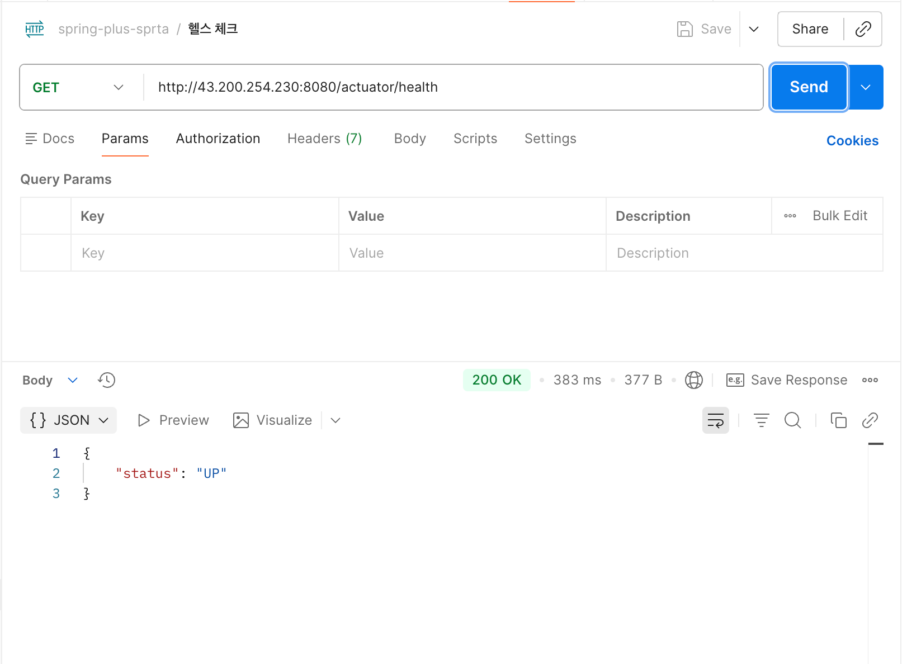

---

## EC2
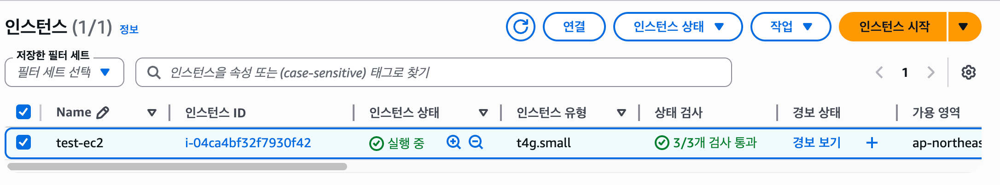

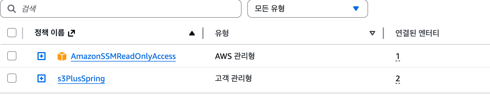

---

## RDS

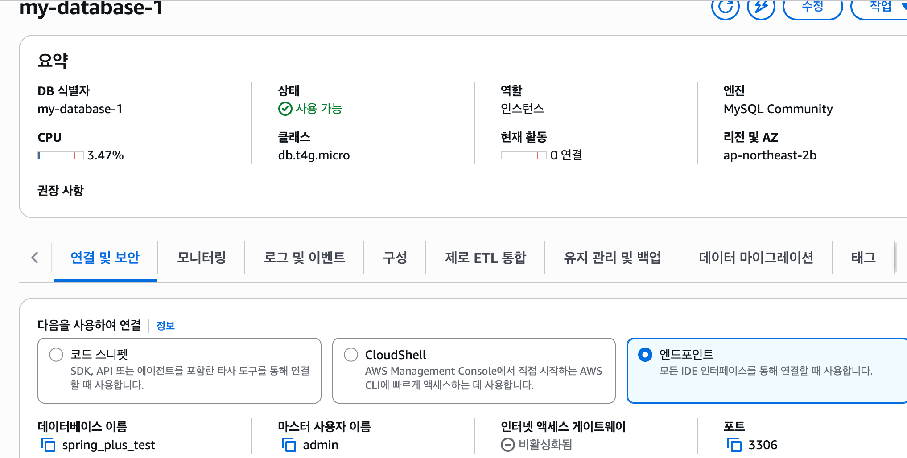

---

## S3

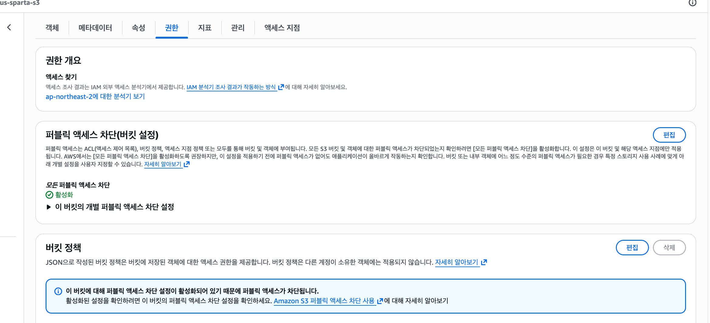

---

## IAM / Parameter Store

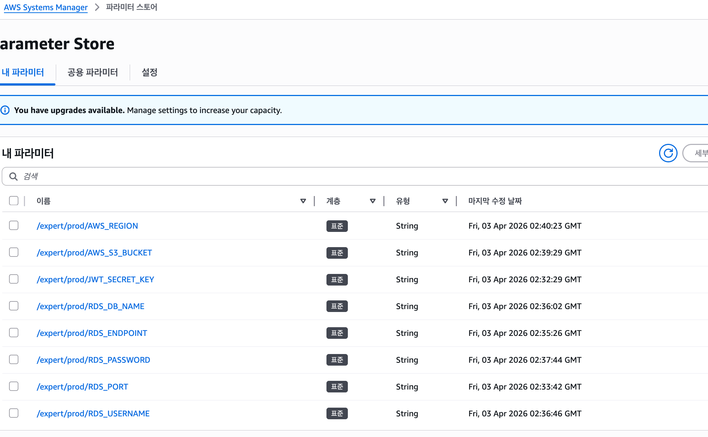

---

## 대용량 데이터 처리 

### 1. 테스트 데이터 생성 
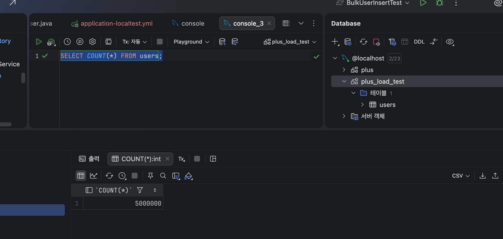
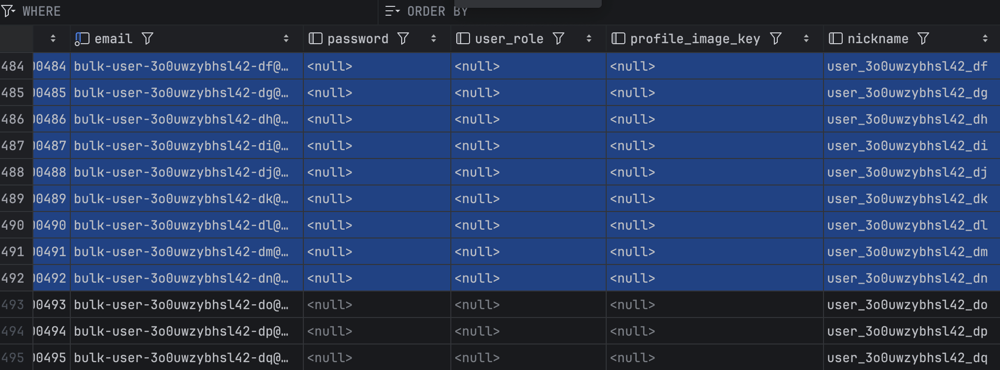

### 2. 인덱스 튜닝 활용

#### (1). 그냥 조회 
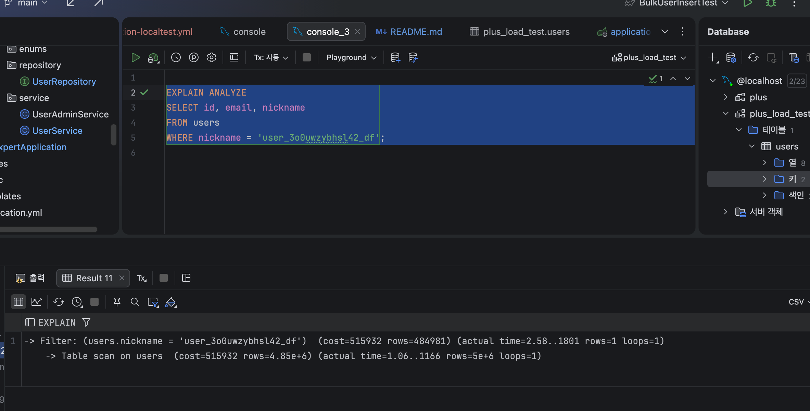

#### (2). 단일 인덱스 조회
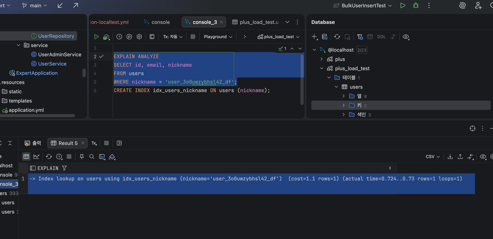

#### (3). 복합 인덱스 조회
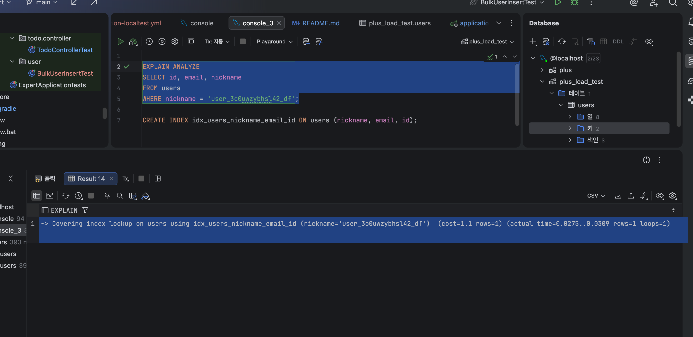

---

### 3. 조회 성능 비교 
#### (1). 조회 성능 비교

| 구분 | 실행 시간 |
|---|---:|
| 인덱스 없음 | 1801 ms |
| 단일 인덱스 적용 | 0.73 ms |
| 복합 인덱스 적용 | 0.03 ms |

#### (2). 성능 개선 비율

| 구분 | 기준 대비 개선 |
|---|---:|
| 단일 인덱스 | 약 2,467배 |
| 복합 인덱스 | 약 60,033배 

---

## 과제 구현 일정

| 날짜 | 진행 내용 |
|---|---|
| 3월 30일 | 과제 프로젝트 세팅 |
| 3월 31일 | 필수 레벨 1 완료 |
| 4월 1일 | 필수 레벨 2 8번까지 완료 |
| 4월 2일 | 필수 레벨 2 완료 및 도전 레벨 3 11번까지 완료 |
| 4월 3일 | 도전 레벨 12번 완료 및 도전 레벨 13번 진행 |
| 4월 4일 | 진행 없음 |
| 4월 5일 | 진행 없음 |
| 4월 6일 | 도전 과제 완료 및 프로젝트 초안 완성 |

