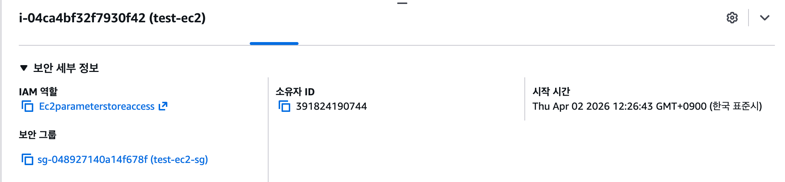
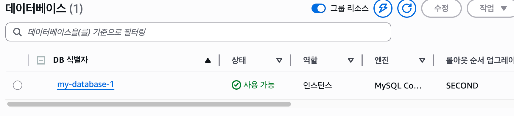
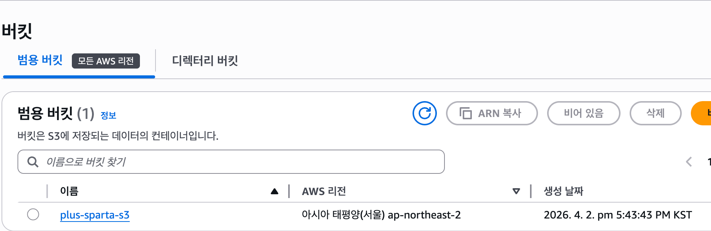
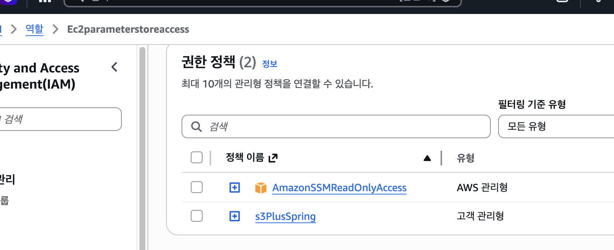

# 📌 SPRING PLUS

---

## 📡 AWS 활용
---

### Health Check

---

### EC2

---

### RDS

---

### S3

---

### IAM / Parameter Store

---

## 🗃️ 대용량 데이터 처리 

### 1. 테스트 데이터 생성 

### 2. 인덱스 튜닝 활용

#### (1). 그냥 조회 

#### (2). 단일 인덱스 조회

#### (3). 복합 인덱스 조회

---

### 3. 조회 성능 비교 
#### (1). 조회 성능 비교

| 구분 | 실행 시간 |
|---|---:|
| 인덱스 없음 | 1801 ms |
| 단일 인덱스 적용 | 0.73 ms |
| 복합 인덱스 적용 | 0.03 ms |

#### (2). 성능 개선 비율

| 구분 | 기준 대비 개선 |
|---|---:|
| 단일 인덱스 | 약 2,467배 |
| 복합 인덱스 | 약 60,033배 

---

## 🗓️ 과제 구현 일정

| 날짜 | 진행 내용 |
|---|---|
| 3월 30일 | 과제 프로젝트 세팅 |
| 3월 31일 | 필수 레벨 1 완료 |
| 4월 1일 | 필수 레벨 2 8번까지 완료 |
| 4월 2일 | 필수 레벨 2 완료 및 도전 레벨 3 11번까지 완료 |
| 4월 3일 | 도전 레벨 12번 완료 및 도전 레벨 13번 진행 |
| 4월 4일 | 진행 없음 |
| 4월 5일 | 진행 없음 |
| 4월 6일 | 도전 과제 완료 및 프로젝트 초안 완성 |

## 프로젝트💭 회고
이번 과제를 진행하면서 단순히 기능을 구현하는 것에 그치지 않고, 실무에서 자주 마주치는 주요 문제들을 직접 경험하고 해결해볼 수 있었다.

먼저, 인증과 인가를 구현하는 과정에서 `Spring Security`의 동작 방식에 대해 이전보다 훨씬 깊이 있게 이해할 수 있었다. 지금까지는 단순히 설정을 따라가서 구현을 했었다. 하지만 요번 과제 프로젝트에서 직접 내가 적용하면서 인증 흐름과 보안 설정의 역할을 직접 확인할 수 있었고, 이를 통해 보안 관련 구현에 대한 자신감도 함께 높아질수 있었다.

또한 조회 성능을 개선하는 과정에서는 `N+1 문제`를 직접 마주하고, 이를 해결하는 방법을 고민해보면서 JPA 조회 전략과 성능 최적화의 중요성을 다시 한 번 체감할 수 있었다. 단순히 데이터를 가져오는 것과, 효율적으로 가져오는 것은 전혀 다르다는 점을 이번 과제를 통해 분명히 배울 수 있었다.

AWS 환경을 다시 구성하고 점검하는 과정도 의미 있었다. EC2, RDS, S3, IAM, Parameter Store 등을 다시 다뤄보면서 이전에 학습했던 내용을 복습할 수 있었고, 단편적으로 알고 있던 내용을 실제 프로젝트 흐름 안에서 다시 연결해볼 수 있었다. 덕분에 배포와 인프라 구성에 대한 이해도도 한층 더 확장되었다.

결과적으로 이번 과제는 단순한 구현 과제를 넘어, 보안, 성능 최적화, 클라우드 인프라까지 전반적인 역량을 다시 점검하고 확장할 수 있었던 경험이였던것 같다. 앞으로는 이번에 학습한 내용을 단순 적용에 그치지 않고, 왜 이런 방식이 필요한지까지 설명할 수 있는 수준으로 더 깊게 발전시켜 나가고 싶다

